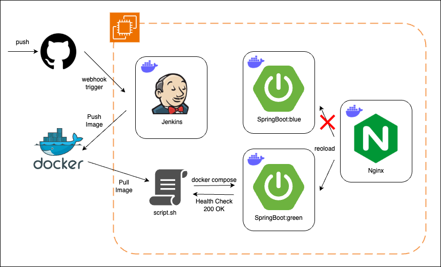

# 당근마켓 클론코딩

## Tech

---
- Java 17
- SpringBoot 3.3.2
- Spring Security
- JUnit5
- Test Container
- MySQL 8.1
- MongoDB 8.0.3
- Redis
- Flyway
- SSE(Server Side Events)
- WebSocket (STOMP)
- RabbitMq
- Jenkins & Github Webhook
- Nginx
- Docker

JWT 토큰으로 Sateless한 인증방식을 사용하기 위해 Spring Security 사용.  
로컬에서 테스트할 때, 서버에서 테스트할 때의 환경적으로 일관성을 지키기 위해 Docker 사용.  
빠른 검색속도를 사용해 자주 사용될 기능에 대해서는 Redis를 사용하여 저장. (Refresh Token, 인기검색어 등)  
로컬과 서버의 데이터베이스 환경을 일치시키기 위해 마이그레이션 도구인 Flyway를 사용.  
실시간 알림의 경우 사용자에게 연결이 끊기지 않고 단방향으로 알림을 전달하기 위해 SSE 사용.  
채팅서비스의 경우 연결이 끊기지 않고 양방향으로  전달하기 위해 웹소켓을 사용하고 빠른 메시지 저장을 위해 MongoDB를 사용.  
STOMP 프로토콜을 사용해 지정된 메시지의 유형을 사용하고, 서버가 여러개일 경우를 대비해 외부 메시지브로커를 사용해서 구현. 

## API Documentation

---
[프로젝트 API 문서 바로가기](http://13.209.224.206/docs/index.html)

## CI/CD 구성

---

1. Github 코드 푸시
2. 웹훅 트리거 발동
3. Jenkins 프로젝트 빌드
4. 프로젝트를 도커 이미지로 빌드 후 도커허브로 push
5. EC2서버의 배포 스크립트 실행
6. 도커 이미지 pull후 프로젝트 실행
7. Health Check에 성공한 경우 Nginx가 green서버를 가리키도록 수정 후 reload  

